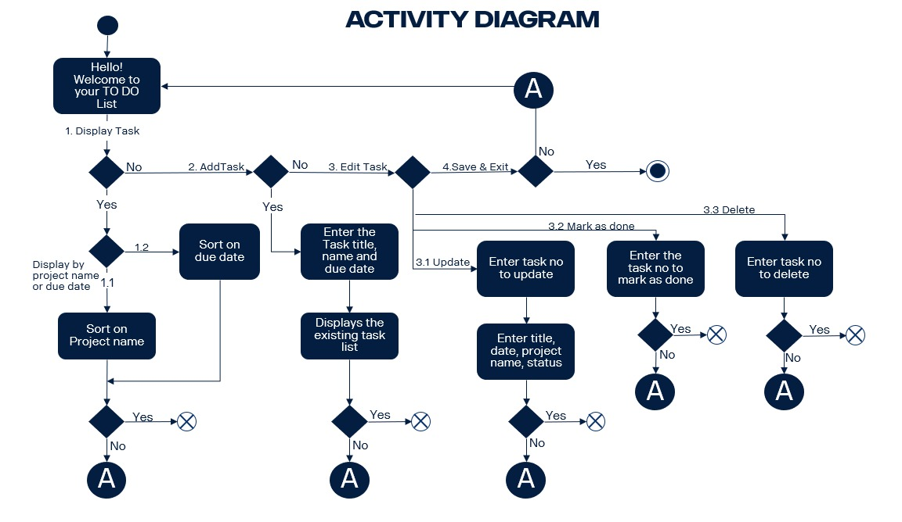

#**Title**
Individual-Project - ToDoList - SDA:9

# A brief overview
Todo list application is a menu-driven project. User will be presented with available options corresponding to 
the selected menu. User will select an option from given choices and press ENTER key to move to next step.
The program will allow the user to add new tasks, display existing tasks, edit tasks, mark task as done, 
delete tasks and save all tasks in the data file, therefore next time when you open the application, it 
will resume its state.

# Features of the Project
This is a project with a text based user interface which helps to keep track of your tasks. 
To be more detailed **it helps to stay organized and manage day to day activities.** 
In this app user is able to do the following tasks:
>>> Create new tasks by entering the title, due date, project name and finally see the status of the tasks
to know which task has been completed and which tasks are yet to be done.

>>> Display the tasks i) by sorting the list of tasks on project name
                     ii) by sorting the list of tasks on  due date

>>> Edit the existing tasks i) Update task title, due date and project name
                           ii) Mark the task as done
                          iii) Delete tasks from the list
                          
>>> Saving all the changes in the list if user wishes to do so.

**#Installation and  User Manual**

This provides a brief introduction on **software installation** and **how to use the project.**

**♗** The project was built using Java Programming Language on **IntelliJ IDEA** platform. The IntelliJ 
platform is open source under the Apache License and hosted on GitHub.

**♗** The project uses **Gradle**, an open source build automation tool. IntelliJ IDEA allows to
import Gradle build configuration using the file **build.gradle** and interact with them.

Steps to follow after the  Software Installation:
1. Clone the repository to your computer.
2. Compile all the files in the folder **src/main/java/todoipsda** in the terminal.
3. Run the file **src/main/java/todoipsda/Main.java** in the terminal.

Once compiled and launched the program is straightforward to use. The text UI will guide 
you through different steps in the project.

The exact overview on how the ToDo List Application has been designed and works can be viewed in the following
[Link](mainMenu.md)

#Testing: 
Tested the Application using the JUnit Platform which serves as a foundation for launching testing 
frameworks on the JVM. Tested few major functionalities like Adding, deleting, marking and getting 
the number of tasks done. Also tested few functionalities on the Task list class.

# Class and Activity Diagram 

