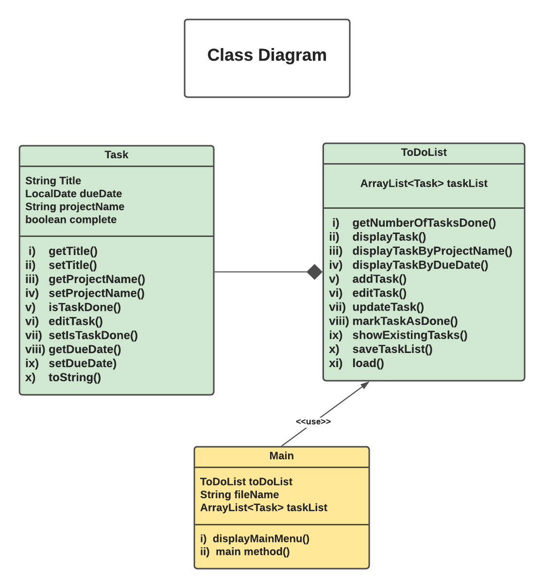

# Individual-Project - ToDoList - SDA:9

This is a project with a text based user interface which helps to keep track of your tasks.

# A brief overview
It is menu-driven. User will be presented with  available options corresponding to selected menu.
User will select an option from the given choices.
The program will allow user to Add, Edit, Remove, Display and Save the tasks.

# The main menu of the application
1. Display task list: It allows to display the tasks by project name or by date.
2. Add a new Task.
3. Edit task: It allows update, delete and mark the tasks completed.
4. Save task and exit the application.

