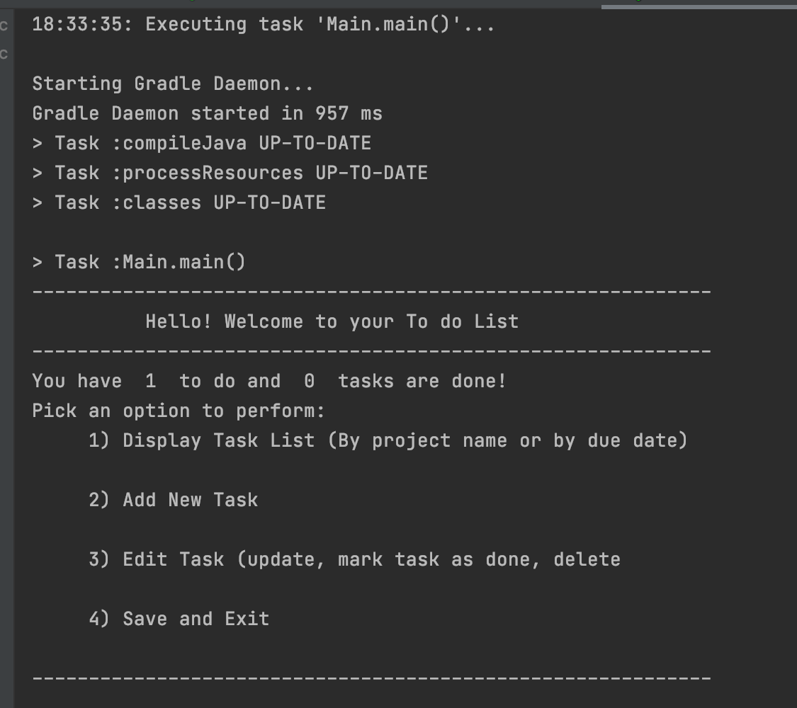

# Individual-Project - ToDoList - SDA:9

# A brief overview
It is menu-driven. User will be presented with  available options corresponding to selected menu.
User will select an option from the given choices.
The program will allow user to Add, Edit, Remove, Display and Save the tasks.

# Description of the Project
This is a project with a text based user interface which helps to keep track of your tasks. 
To be more detailed it helps to stay organized and manage day to day activities. 
In this app user is able to the following:
>> Create new tasks by giving the title, due date, project name and finally see the status of the tasks to know which 
task has been completed and which tasks are yet to be done.

>> Display the tasks i) sorting the list of tasks by project name
                    ii) sorting the list of tasks by due date

>> Edit the existing tasks i) Update task title, due date and project name
                          ii) Mark the task as done
                         iii) Delete tasks from the list
                          
>> All the changes are saved in the list if user wishes to do so.

# Tools
IntelliJ IDEA

# Class Diagram

#User Manual

This provides a brief introduction on how to use the program.
The project was build using Java Programming Language on IntelliJ IDEA. It has simple GUI where the user inputs certain
tasks. The program can be runned in IntelliJ terminal.
The application uses Gradle, an open source build automation tool.

The main menu of the application when you run the program looks as below:

