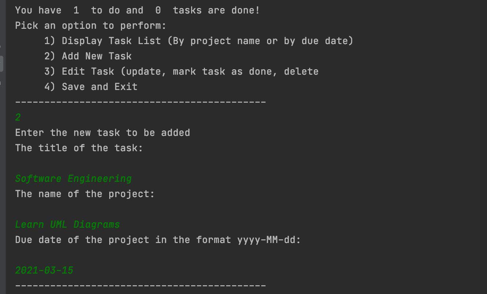

# Individual-Project - ToDoList - SDA:9

This is a project with a text based user interface which helps to keep track of your tasks.
It is menu-driven. User will be presented with  available options corresponding to selected menu.
User will select an option from the given choices.
The program will allow user to Add, Edit, Remove, Display and Save the tasks.

**User Manual**

When you run the program you will view the main menu of the program as shown below:

# The main menu of the application
-------------------------------------------
    Hello! Welcome to your To do List     
-------------------------------------------
You have 0 tasks todo and 0 tasks are done!
            
  Pick an option to perform:
  1) Display Task List (By project name or by due date)
  2) Add New Task
  3) Edit Task (update, mark task as done, delete
  4) Save and Exit
 -------------------------------------------

