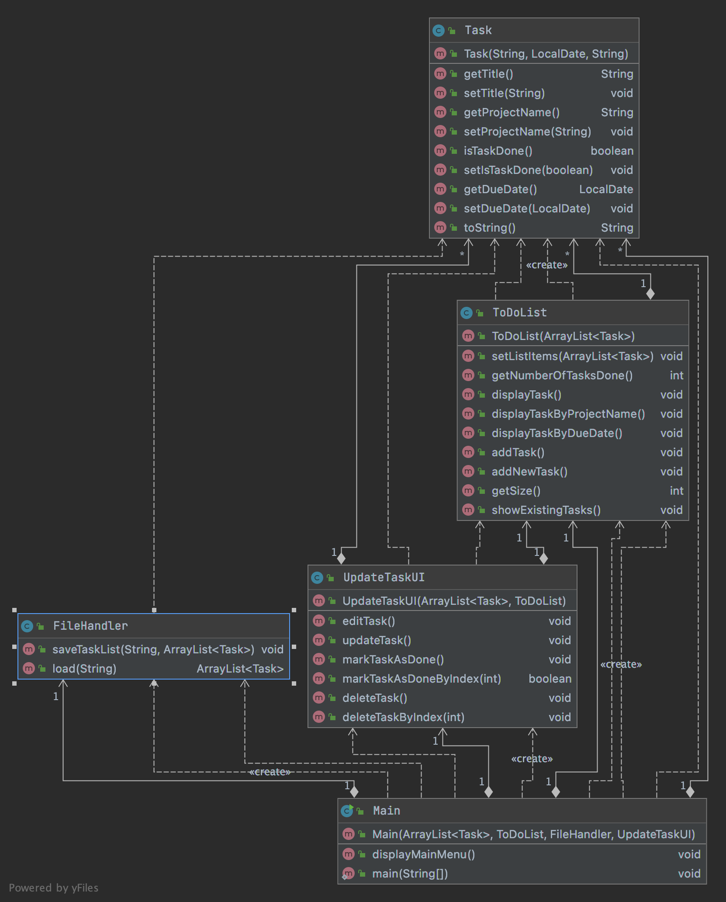

#Title
Individual-Project - ToDoList - SDA:9

# A brief overview
This is a menu-driven project. User will be presented with available options corresponding to selected 
choice from the main menu. The program will allow the user to Add new tasks, display existing tasks, edit tasks, 
mark task as done, delete tasks, save and exit from the main menu.

# Features of the Project
This is a project with a text based user interface which helps to keep track of your tasks. 
To be more detailed it helps to stay organized and manage day to day activities. 
In this app user is able to do the following:
>>> Create new tasks by giving the title, due date, project name and finally see the status of the tasks to know which 
task has been completed and which tasks are yet to be done.

>>> Display the tasks i) by sorting the list of tasks by project name
                     ii) by sorting the list of tasks by due date

>>> Edit the existing tasks i) Update task title, due date and project name
                           ii) Mark the task as done
                          iii) Delete tasks from the list
                          
>>> Saving all the changes in the list if user wishes to do so.

**#User Manual**

This provides a brief introduction on **how to use the project.**
**♗** The project was build using Java Programming Language on **IntelliJ IDEA** which needs to be installed.
It has simple UI where the user inputs certain tasks and saves it.

**♗** The application uses **Gradle**, an open source build automation tool which needs to 
be installed before running the project.

_After Required Software Installation:_
1. Clone the repository to your computer.
2. Compile all the files in the folder **src/main/java/todoipsda** in the terminal.
3. Run the file **src/main/java/todoipsda/Main.java** in the terminal.

Once compiled and launched the program is straightforward to use. The text UI will guide 
you through different steps in the project.

The exact overview of how the ToDo List Application has been designed and works can be viewed in the following
[Link](mainMenu.md)

# Class Diagram

