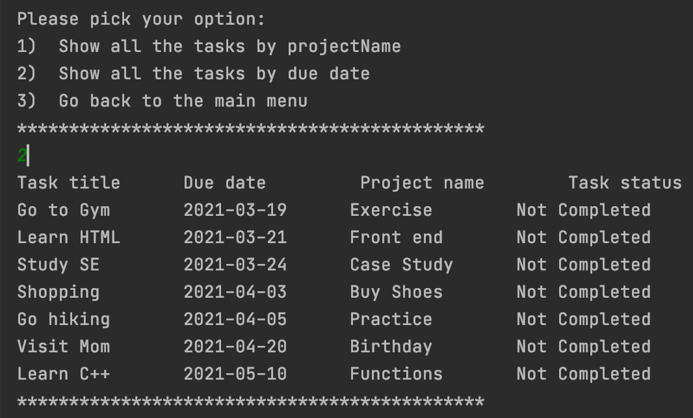

# Viewing the Functionalities of the To Do List Project

1. The main menu of the application when you run the program:
   
   
2. Display Task list
In the first option it allows to display the tasks by sorting project name:
   

In the second option it allows to display the tasks by sorting due date:
   

3. Add a new Task
   
   
   
4. Edit a Task
   
   
   
   
   
   
5. Save and exit the application
   

